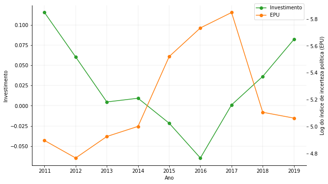

# Economic Policy Uncertainty and Investment Decisions in Brazil

## Abstract
This paper investigated the relation between economical political uncertainty and investment decisions of Brazilian firms with different financial constraints characteristics. The sample took financial data from 210 open capital firms between the years 2010 and 2019. The companies were classified as financially constrained and not financially constrained through the KZ, WW and SA indexes. The data was analyzed through descriptive statistics and estimates made with the generalized method of moments (GMM-sys). The results pointed out that economical political uncertainty has a negative effect on Brazilian companies investment rate. Furthermore, the non financial constrained company group didn’t showcase investment sensibility to economical political uncertainty, while the financial constrained group demonstrated a negative relationship to it. This study brings evidence that issues in the Brazilian political side discourages investments, mainly in companies with high reliance on internal resources.

## Main Model

## Financial constraints investment and policy uncertainty

## Main results

